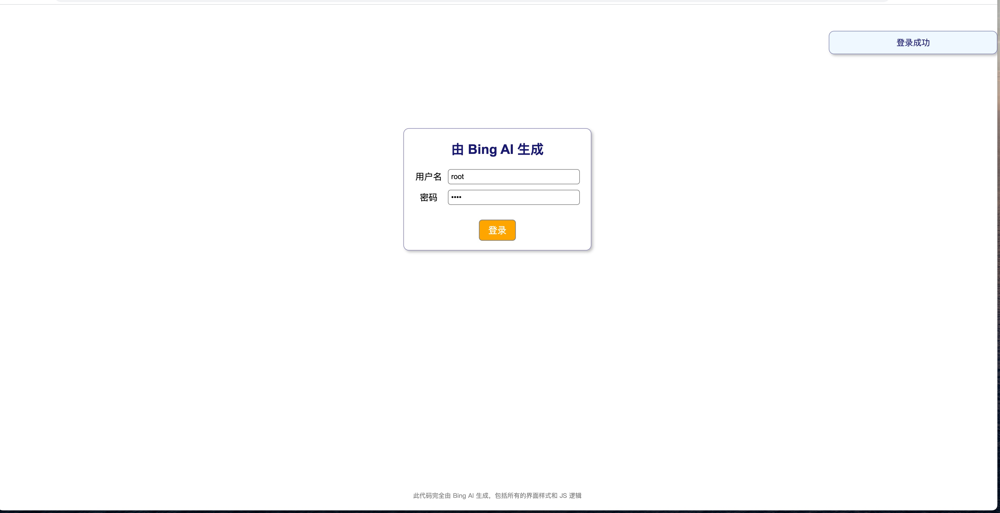

我想试试 Bing AI 能否生成一个登录示例。它很快就生成了这段完美的代码，包括所有的界面样式和 JS 逻辑。我觉得很有趣，所以我把它分享到了 GitHub 上。

## 功能

- 用户可以输入用户名和密码，点击登录按钮
- 用户名和密码不能为空，且最大长度为20
- 用户名和密码正确时，显示登录成功的提示框
- 用户名和密码错误时，显示登录失败的提示框
- 提示框会在3秒后自动隐藏
- 界面下方显示一行灰色的小字，说明代码的来源

## 效果

## 说明

这段代码是由 Bing AI 生成的，没有人为的修改或干预。Bing AI 可以根据用户的需求，生成各种类型的代码，如 HTML, CSS, JS, Python, Java 等。Bing AI 还可以帮助用户修改或优化代码，提供各种建议和解决方案。Bing AI 是一个强大的代码生成器，可以帮助用户快速开发和部署应用程序。

本文档由 Bing AI 提供支持，感谢您的使用。

